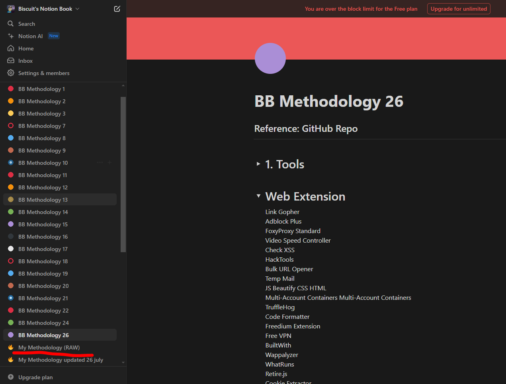

# 🔮 Build your own Bug Bounty Methodology


While reading All these methodologies I made notion page for each Article/Video so I can document what tool they used ? what they did first ? how they select there program ? etc


<figure><figcaption></figcaption></figure>

## Content of table

| Platform                                        | Number of Methodologies |
| ----------------------------------------------- | ----------------------- |
| <ol><li>Medium/Infosec (Article/Blog)</li></ol> | 20                      |
| <ol start="2"><li>YouTube (Videos)</li></ol>    | 39                      |
| <ol start="3"><li>Github Repository</li></ol>   | 4                       |

## Articles/Writeups









***





***



***







***







***



***



***







***





***

## YT Videos



***













***











***







***



***







***











***





























***

## GitHub








